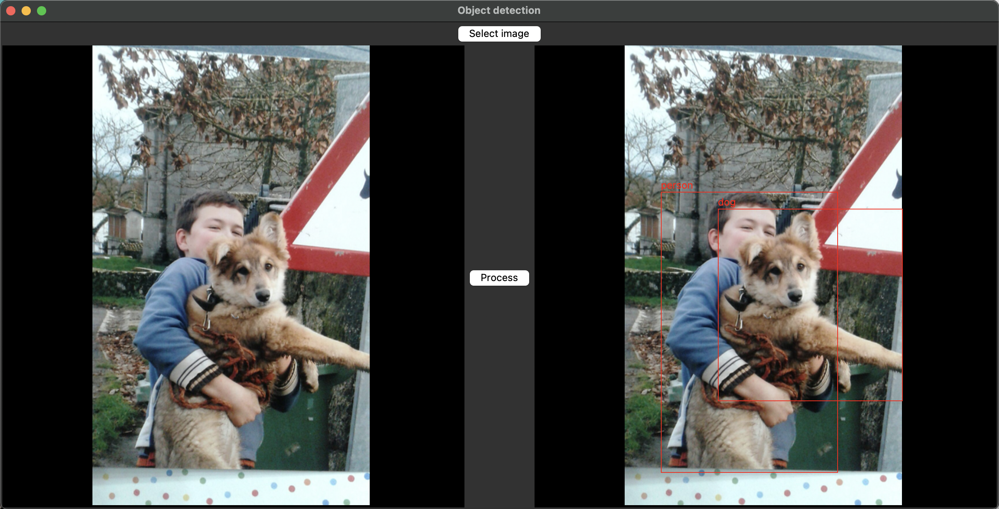

# Object detection

Very simple app using python and [Yolos](https://huggingface.co/hustvl/yolos-tiny) to detect objects in images.

### Tested with:

```shell
Python 3.11.4
pip 23.1.2
virtualenv 20.23.0
```

## Try it out:

```shell
$ python3 -m virtualenv env
$ source env/bin/activate
$ pip3 install -r requirements.txt
$ python3 app.py
```

It downloads the model (first time only)

And then it opens and you can try it with any image:



To finish:

```shell
CTRL-C
$ deactivate
```